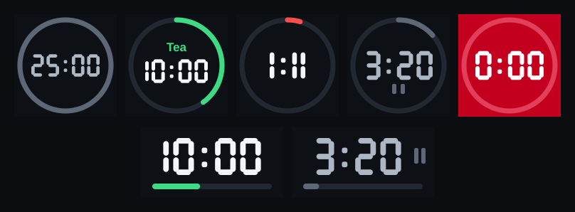

# Countdown for OpenDeck

[](https://github.com/NyleGarcia/countdown-opendeck/actions/workflows/ci.yml)
[](https://github.com/NyleGarcia/countdown-opendeck/releases/latest)

A countdown timer for Stream Deck keys and Stream Deck+ dials, built for
[OpenDeck](https://github.com/nekename/OpenDeck) on Linux. You set the duration per key. The key
shows big digits inside a progress ring, and it flashes and plays a sound when the timer ends.



## Features

- **Configurable duration:** hours, minutes and seconds, plus one-click presets (1m, 5m, 10m, 15m, 25m, 1h).
- **Readable at a glance:** seven-segment digits are drawn into the key image, so they don't depend
  on OpenDeck's title font size.
- **Progress ring:** green, then amber under 25%, then red under 10%. It turns grey with pause bars when paused.
- **Stream Deck+ touch strip:** large digits over a progress bar.
- **Finish alarm:** the key flashes red and plays a sound. The sound can repeat until you dismiss it.
- **Overtime (optional):** keeps counting up after zero, for example `+0:12`.
- **Optional label:** a short name drawn above the time, like "Tea" or "Pomodoro".
- **Runs in the background:** a timer keeps going when you switch pages or profiles.
- **No dependencies:** plain Node.js, no `npm install`.

## Controls

| Key | Does |
|---|---|
| Tap | Start / pause |
| Hold (≥ 0.6 s) | Reset |
| Tap while ringing | Dismiss and reset |

| Dial (Stream Deck+) | Does |
|---|---|
| Rotate | Change the duration (only while stopped) |
| Press | Start / pause |
| Touch the strip | Reset |

If you change the duration while a timer is running, the new value takes effect on the next reset.

## Settings

Select the key in OpenDeck to open its settings panel.

| Setting | Default | Notes |
|---|---|---|
| Duration | 5:00 | Up to 99:59:59 |
| Label | *(none)* | Up to 12 characters, shown above the time |
| Flash key when done | On | |
| Play sound when done | On | Uses `pw-play`, falling back to `paplay` |
| Repeat sound until dismissed | Off | |
| Keep counting up after zero | Off | Shows `+M:SS` |
| Sound file | `/usr/share/sounds/freedesktop/stereo/alarm-clock-elapsed.oga` | Any file your player can read. Use **Test sound** to check it. |
| Dial step | 1 minute | 1 s, 5 s, 15 s, 30 s, 1 min or 5 min per click |

## Requirements

- Linux with [OpenDeck](https://github.com/nekename/OpenDeck) (tested with 7.1.0)
- [Node.js](https://nodejs.org) **22 or newer** (it has the built-in WebSocket client the plugin uses)
- For sound: PipeWire (`pw-play`) or PulseAudio (`paplay`)

## Install

### From a release

1. Download `countdown-opendeck-X.Y.Z.zip` from the
   [latest release](https://github.com/NyleGarcia/countdown-opendeck/releases/latest).
   You can check it against the `.sha256` file with `sha256sum -c`.
2. Install it with OpenDeck's install-from-file option in the Plugins view. Or install it by hand:
   ```sh
   unzip countdown-opendeck-*.zip -d ~/.config/opendeck/plugins/
   ```
3. Restart OpenDeck and drag **Countdown → Countdown Timer** onto a key or dial.

### From source (development)

```sh
git clone https://github.com/NyleGarcia/countdown-opendeck.git
cd countdown-opendeck
scripts/install.sh   # symlinks the plugin into ~/.config/opendeck/plugins
```

Restart OpenDeck after installing. Because it's a symlink, edits take effect on the next OpenDeck restart.

### Uninstall

```sh
rm -rf ~/.config/opendeck/plugins/dev.countdown.sdPlugin
```

## Troubleshooting

**The key stays blank or never shows a time.** The plugin probably couldn't find Node. OpenDeck
starts plugins with a minimal `PATH`, so `run.sh` looks for Node in these places, in order:

1. `$COUNTDOWN_NODE`
2. `~/.local/node/bin/node`
3. `~/.volta/bin/node`
4. `/usr/local/bin/node`
5. `/usr/bin/node`
6. whatever `node` is on `PATH`

If your Node lives somewhere else (nvm, fnm, asdf, …), set `COUNTDOWN_NODE` in the environment
OpenDeck starts with. Another option is to symlink your Node binary to `/usr/local/bin/node`.

**Where are the logs?** OpenDeck writes the plugin's output to
`~/.local/share/opendeck/logs/plugins/dev.countdown.sdPlugin.log`. For more detail, start OpenDeck
with `COUNTDOWN_DEBUG=1`.

**No sound.** Press **Test sound** in the settings. Check that the sound file exists and that
`pw-play <file>` plays it from a terminal.

## Development

### Test

```sh
node scripts/smoke-test.js
```

The smoke test stands in for OpenDeck with a small WebSocket server. It starts the plugin through
`run.sh` and runs it through start, pause, finish, hold-to-reset, settings changes, the dial,
overtime and the touch-strip layout, all over the real Stream Deck SDK protocol.

**CI** runs on every push and pull request. It syntax-checks the JavaScript, validates the manifest
and the files it points to, runs `shellcheck` on the shell scripts, and runs the smoke test.

### Releasing

Releases follow [semantic versioning](https://semver.org). The `Version` field in
`dev.countdown.sdPlugin/manifest.json` is the source of truth.

```sh
scripts/release.sh patch            # 0.1.0 -> 0.1.1
scripts/release.sh minor            # 0.1.1 -> 0.2.0
scripts/release.sh major            # 0.2.0 -> 1.0.0
scripts/release.sh 1.1.0-rc.1       # explicit version / prerelease
scripts/release.sh patch --push     # also push the commit and tag
```

The script bumps `Version`, commits `Release vX.Y.Z` and creates the tag `vX.Y.Z`. It refuses to run
with uncommitted changes, reuse an existing tag, or go to a lower version. Bumping a prerelease
finalises it, so `1.0.0-rc.1` becomes `1.0.0`.

Pushing the tag starts the **Release** workflow. It checks that the tag matches the manifest
version, runs the smoke test, and publishes `countdown-opendeck-X.Y.Z.zip` plus its `.sha256`
checksum as a GitHub Release with generated notes. Tags with a suffix, like `-rc.1`, are published
as prereleases.

### Project layout

```
dev.countdown.sdPlugin/     the plugin (this folder is what ships in the zip)
  manifest.json             action, key and dial definition
  run.sh                    cleans up the launcher environment and finds Node
  plugin.js                 timer logic and SVG rendering (keys and touch strip)
  pi/timer.html             settings panel (property inspector)
  layouts/strip.json        touch-strip layout: one full-size image
  icons/                    SVG icons
scripts/
  install.sh                symlink into OpenDeck (development)
  smoke-test.js             end-to-end protocol test
  release.sh                semver bump and tag
.github/workflows/          CI and Release
```

### Design notes

- **Digits are drawn shapes, not text.** OpenDeck draws titles at the user's font size, which
  defaults to 14 and is too small to read on a key. Drawing the digits in the image keeps them large.
  The OpenDeck title is always left empty.
- **The touch strip uses a custom layout.** The built-in `$A0` layout has a second image area that
  OpenDeck shows as a checkerboard when it's empty. It also falls back to the action name when the
  title is empty. A layout with a single full-size image avoids both.
- **Timers are kept in memory.** Restarting OpenDeck resets any running timers, but the duration and
  other settings are saved.
